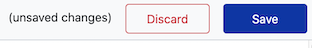
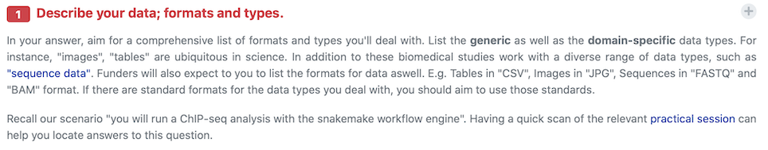

# Data Stewardship Wizard practical

The Data Stewardship Wizard, hereon DSW, is an awareness tool in the area of research data management (RDM). 
In this practical you'll fill in a questionnaire using DSW. The questionnaire will guide you through key requirements in RDM making you think if and how your meet those requirements in your project.

## Required material

Before starting the practical, make sure you have the following ready, if not, please notify your session instructor.

* The URL link for DSW training instance.
* User credentials to login to the training instance.
* The _example scenario_ for the [workshop](https://github.com/elixir-luxembourg/DS-DM-training).

## Exercise 1: Create and fill in questionnaire

In the DSW tool, _Knowledge Models_ act as source databases that hold requirements in one or more sub-area of RDM.  
The tool comes pre-packed with a comprehensive default knowledge model. In this practical we will use a cut-down version of this model.

1. Login to the DSW. 
2. On the left-hand side navigation menu click _Knowledge Models_ to list models available. You should see "DM-DS Workshop Model" as below:        
3. Click on the knowledge model to go to its overview page showing version history and available actions. 
4. Click on the create questionnaire button to create a new questionnaire from the model:       
5. Provide a name for your questionnaire, try to use a name that can distinguish your record from other participants e.g. your user id or name. Also, set the accessibility level of your model to "Public" or "Public Read-Only", then click "Save".        
6. Your questionnaire will be displayed and is ready to be filled.        
7. The DSW provides a filtering feature that allows you to see questions only relevant to a particular phase of a research project. From the "Current Phase" list select "Before Submitting the DMP". This will allow you to view and answers all questions for our practical.        

When filling in the questionnaire pay attention to the following:

 - do not forget to save your answers from time to time       
 - under most questions you'll find an explanation that might help you with your answers       
 - for some questions you'll provide more than one answer, for instance when specifying "Contributors" in the "Administrative details" section. Clicking "Add" button at the end of the question will add a new empty answer       

## Exercise 2

TODO