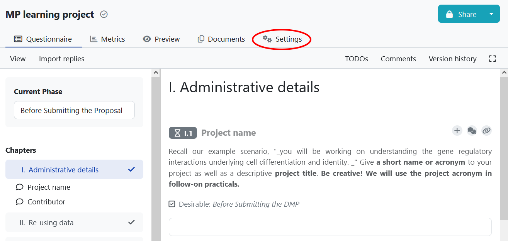

# Practical with the Data Stewardship Wizard

The [Data Stewardship Wizard (DSW)](https://ds-wizard.org/about.html), is an awareness tool in the area of research data management (RDM) which helps researchers and data stewards with writing data management plans (DMP) for FAIR Open science. 
In this practical, you will prepare a data management plan for your postdoc project, you'll do so via filling questionnaire using the DSW.
The questionnaire will guide you through key requirements in RDM making you think if and how to meet those requirements in your project. 

## Required material

Before starting the practical, make sure you have the following ready, if not, please notify your session instructor.

* The URL [link](https://learning.ds-wizard.org/) for DSW training instance.
* The [example scenario](https://github.com/elixir-luxembourg/DS-DM-training/blob/master/resources/DM-DP_RunningExample.pdf) for our workshop.

## Exercise 1: sign up (1 min)

* Go to [the DSW training instance](https://learning.ds-wizard.org/) and click `Sign up`.       

## Exercise 2: Create project (questionnaire) from existing knowledge model (2 min)

In the DSW tool, _Knowledge Models_ act as source databases that hold requirements in one or more sub-area of RDM.  
The tool comes pre-packed with a comprehensive default knowledge model. In this practical we will use a cut-down version of this model. To create and fill in a questionnaire:

1. Login to the DSW. 
2. On the right-hand click `Create` to create a project:       
3. Provide a name for your project, try to use a name that can distinguish your record from other trainees, for example include your username in the project name. In addition, you may share your project with others. You may allow either DSW tool users or anyone with a link to view/edit your answers. 
4. Select `Knowledge Model` for your project. We recomend for this practical to use **DM-DS_Workshop_Model** or you can use **Life Sciences DSW Knowledge Model**. Clicking `Create` will create your project. Each project is a questionnaire that represents an instantiation of the knowledge model.        .

## Exercise 3: Preview (empty) report from your  questionnaire (1 min)

*  Go to your newly created empty project/questionnaire. To create a preview report from your questionnaire, click on the `Settings` on the top navigation menu.       
*  Select the required template (FNR Template) and the `HTML` as default format. `Save` your changes.       
*  Then click on `Preview` on the top navigation menu to go to the overview of the document and see the different sections of the FNR template (empty) at the moment.      

## Exercise 4: Fill in the questionnaire" (40 min)

1. Go back to the your questionnaire which is ready to be filled. Under most of the questions you will find hints related to the [training scenario](https://github.com/elixir-luxembourg/DS-DM-training/blob/master/resources/DM-DP_RunningExample.pdf).        
2. The DSW provides a filtering feature that allows you to see questions only relevant to a particular phase of a research project. From the `Current Phase` list select `Before Submitting the DMP`. This will allow you to view and answers all questions for our practical.        

When filling in the questionnaire pay attention to the following:

- for some questions you may provide more than one answer. If you want to add a new answer click the `Add` button at the end of your last answer.       

## Exercise 5: Generate report of your filled questionnaire (1 min)

1. Once you complete the questionnaire, export the (filled) report from your questionnaire: on the navigation menu click on `Documents` and create `New Document`. Select the FNR Template and the export format and click on the `Create` button to generate the report.       
2. For download, click on the three dots menu next to your document and choose `Download`.       
