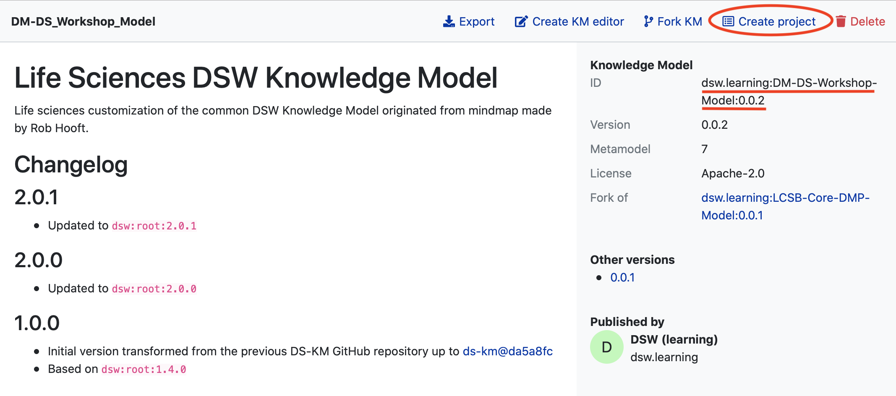
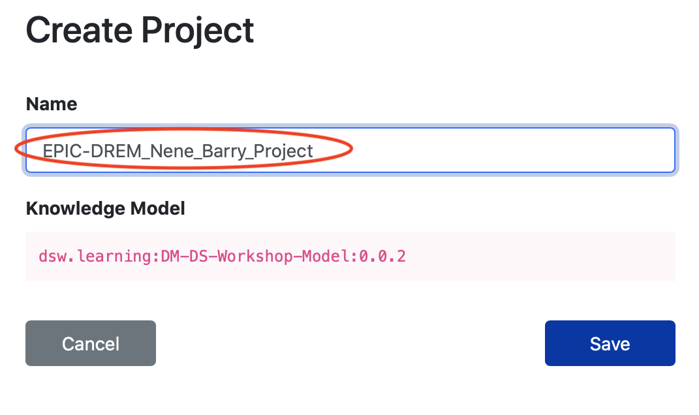

# Practical with the Data Stewardship Wizard

The Data Stewardship Wizard, hereon DSW, is an awareness tool in the area of research data management (RDM). 
In this practical you'll fill in a questionnaire using the DSW. The questionnaire will guide you through key requirements in RDM making you think if and how your meet those requirements in your project.

## Required material

Before starting the practical, make sure you have the following ready, if not, please notify your session instructor.

* The URL link for DSW training instance.
* The [example scenario](https://github.com/elixir-luxembourg/DS-DM-training/blob/master/resources/DM-DP_RunningExample.pdf) for our workshop.

## Exercice 1 : sign up

* Go to the url [link](https://learning.ds-wizard.org/)  for DSW training and sign up.

## Exercise 2: Create questionnaire (project) from existing knowdlege model

In the DSW tool, _Knowledge Models_ act as source databases that hold requirements in one or more sub-area of RDM.  
The tool comes pre-packed with a comprehensive default knowledge model. In this practical we will use a cut-down version of this model. To create and fill in a questionnaire:

1. Login to the DSW. 
2. On the left-hand side navigation menu click `Knowledge Models` to list models available. You should see `DM-DS Workshop Model` as below:        
3. Click on the knowledge model named `DM-DS_Workshop_Model` to go to its overview page, which displays model's version history and available actions. 
4. Click `Create project` on top right to create a new questionnaire from the workshop model:       
5. Provide a name for your questionnaire, try to use a name that can distinguish your record from other trainees, for example include your user name in the questionnaire name. In addition, you may share your questionnaire with others. You may allowing either DSW tool users or anyone with a link to view/edit your answers. Clicking `Save` will create your questionnaire.        

## Exercice 3: Export (empty) report from your questionnaire

 1. Export a (empty) report of your questionnaire as a document: on the left-hand side navigation menu click `Documents`and select the `Create Document` button. After that, select the required template (FNR Template) , then select the export format that you need and click on the `Create` button.       
2. Click on the three dots menu next to your document, `Download` and`open` it.        . Once this is done, you will be able to see in the document the different sections of the FNR template (empty) at the moment.

## Exercice 4: Answer questions in the questionnaire

1. Go back to the your questionnaire which is ready to be filled. Under most of the questions you will find hints for the questions.        
2. The DSW provides a filtering feature that allows you to see questions only relevant to a particular phase of a research project. From the `Current Phase` list select `Before Submitting the DMP`. This will allow you to view and answers all questions for our practical.        

When filling in the questionnaire pay attention to the following:

 - for some questions you may provide more than one answer. If you want to add a new answer click the `Add` button at the end of your last answer.       

## Exercise 5: Export and share (filled) report from your questionnaire

1. Once you complete the questionnaire, on the top right corner, click on the `Share` button. You can share it with your collaborator, by adding their user name, while defining the rights you wish to grant them (owner, editor, viewer). Click on the save button when finished.       .
2. Then you can create a (filled) report of your questionnaire.
